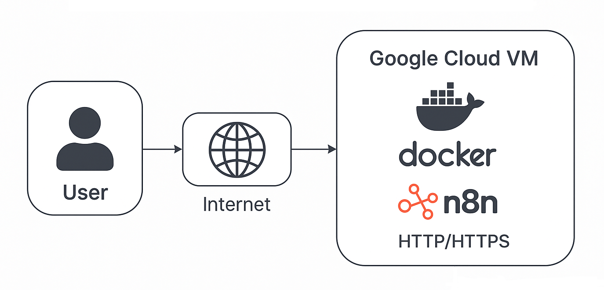

# Deploy a Free n8n Instance on Google Cloud



This project provides a one-shot installer to deploy n8n — a powerful open-source workflow automation tool — on a free-tier Google Cloud VM with HTTPS support via Let's Encrypt. It's ideal for individuals or small teams looking to self-host n8n at zero cost using Google Cloud’s generous free compute offering. The setup script installs Docker, Nginx, and n8n, configures reverse proxying, and automatically provisions SSL certificates.

**⚠️Note:** This setup uses local storage only (no PostgreSQL). It is not production-ready and is recommended only for small, personal workflows.

---

## 1. Create a Free Tier VM

> **Note:** Google Cloud Free Tier VM types, quotas, and features might change in the future. Always follow the latest official guidelines here:  
> [Google Cloud Free Tier Features](https://cloud.google.com/free/docs/free-cloud-features)


- Go to the [Google Cloud Console](https://console.cloud.google.com/).
- Navigate to **Compute Engine → VM Instances → Create Instance**.
- Select the **"E2-micro"** machine type (this is included in the Google Cloud Free Tier).
- Choose **Ubuntu (stable version)** as the OS.
- **Before creating the VM, enable these firewall options:**
  - **HTTP traffic:** Allows web traffic to your server (port 80).
  - **HTTPS traffic:** Allows secure web traffic (port 443).
  - **Allow Load Balancer Health checks:** Needed for Google Cloud's load balancer and uptime checks.
- **Why?** These firewall rules ensure your server is accessible for web and secure traffic, and can be monitored for uptime.

---

## 2. Reserve a Static External IP (optional)

- After your VM is ready, go to **VPC Network → External IP addresses**.
- Click "Reserve" next to your VM to assign a static IP.
- **Why?** This ensures your server's IP doesn't change, so your DNS always points to the right place.

---

## 3. Update Your DNS

- Go to your domain provider's dashboard.
- Add an **A record** pointing your subdomain (e.g., `n8n.yourdomain.com`) to your VM's external IP.

---

## 4. Open Firewall Ports for n8n

- In Google Cloud Console, go to **VPC Network → Firewall**.
- Add a rule to allow **TCP connections from 0.0.0.0/0** (all IPs) for ports **5678** (n8n default), and **5687, 5689** if needed.
- **Why?** This allows external access to your n8n instance on those ports.

---

## 5. Deploy n8n

Open SSH from GCP "Compute Engine" instance, and follw the steps:

1. **Install Git (if not already installed):**
   ```bash
   sudo apt update && sudo apt install git -y
   ```

2. **Clone this repo and enter the directory:**
   ```bash
   if [ ! -d "n8n-docker-deploy-on-vm" ]; then
   git clone https://github.com/smrutijz/n8n-docker-deploy-on-vm.git
   fi

   cd n8n-docker-deploy-on-vm
   git pull
   ```

3. **Run the setup script:**
- First arg should be your domain-name (FQDN)
- Second arg should be your email-id
   ```bash
   chmod +x setup.sh
   sudo ./setup.sh "<your-domain-name>" "<your-email-id>"
   ```


## License

This project is licensed under the [MIT License](https://opensource.org/licenses/MIT).

---

For any questions or support, please contact **Smruti** at [smrutijz@hotmail.com](mailto:smrutijz@hotmail.com).

Connect with me on [LinkedIn](https://www.linkedin.com/in/smrutijz/).

You can also chat with my AI bot, **SmrutiRBot**, on Telegram! Simply scan the QR code below to get started:

[](https://t.me/SmrutiRBot)
